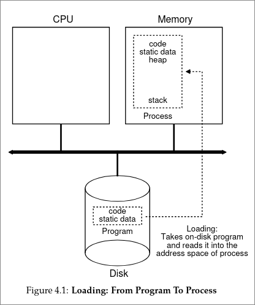
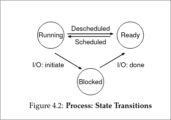

# The Abstraction: The Process

> https://pages.cs.wisc.edu/~remzi/OSTEP/cpu-intro.pdf 

## 1. The Core Concept
* **Definition:** A process is simply a **running program**.
* **Program vs. Process:**
    * *Program:* Lifeless bytes sitting on a disk (instructions, static data).
    * *Process:* The OS executes those bytes, turning them into active tasks.

## 2. Virtualizing the CPU
* **The Goal:** Provide the illusion that the system has many CPUs, even if it only has one or two.
* **The Technique: Time Sharing.**
    * The OS runs one process, stops it, runs another, and so on.
    * This happens so fast that it feels like multiple things are running at once.
    * *Trade-off:* Running many processes can slow overall performance.

## 3. Mechanism vs. Policy
To implement virtualization, the OS uses two approaches:
1.  **Mechanism (The "How"):** Low-level protocols.
    * *Example:* A "Context Switch" (physically stopping one program and starting another).
2.  **Policy (The "Which"):** High-level intelligence/algorithms.
    * *Example:* A "Scheduler" decides which process *should* run next based on history or priorities.

## 4. Machine State
To manage a process, the OS must track its "Machine State" (what the program is reading/updating):
* **Memory (Address Space):** Where instructions and data sit.
* **Registers:** Fast memory on the CPU.
    * *Program Counter (PC):* Tells the CPU which instruction to execute next.
    * *Stack Pointer:* Manages function calls, parameters, and return addresses.
* **I/O Information:** List of files the process currently has open.

## 5. Process API
Standard Operating Systems provide these basic interfaces:
* **Create:** Launch a new program (e.g., shell command, double-clicking an icon).
* **Destroy:** Forcefully halt a runaway program.
* **Wait:** Pause until a process stops running.
* **Control:** Suspend or resume a process.
* **Status:** Check info (how long it has run, current state).

  

## 6. How a Process is Created
The OS performs these steps to turn a disk program into a running process:
1.  **Load:** Reads code and static data from disk into memory. (Modern OSes do this "lazily"—only loading pieces as needed).
2.  **Allocate Stack:** Sets up memory for local variables, function params, and return addresses. Initializes `argc`/`argv`.
3.  **Allocate Heap:** Sets up memory for dynamic data (user-requested via `malloc()`).
4.  **Setup I/O:** Establishes standard input, output, and error file descriptors.
5.  **Start:** Jumps to the `main()` routine to begin execution.

## 7. Process States
A process is usually in one of three states:
1.  **Running:** Currently executing instructions on the CPU.
2.  **Ready:** Ready to run, but the OS is currently running something else.
3.  **Blocked:** Cannot run because it is waiting for an event (e.g., waiting for data from a disk or network).

  

### State Transitions
* **Scheduled:** Ready $\rightarrow$ Running.
* **Descheduled:** Running $\rightarrow$ Ready (Time is up!).
* **Block:** Running $\rightarrow$ Blocked (Initiated I/O).
* **Unblock:** Blocked $\rightarrow$ Ready (I/O is done).

## 8. Data Structures
* **Process List (Task List):** The OS keeps a list of all ready/blocked/running processes.
* **Process Control Block (PCB):** A C-structure containing all data for a specific process:
    * Register context (saved here when process stops so it can resume later).
    * Process State (Running, Ready, etc.).
    * Process ID (PID).
    * Open files.
* **Zombie State:** A process that has exited but hasn't been cleaned up by its parent yet.

